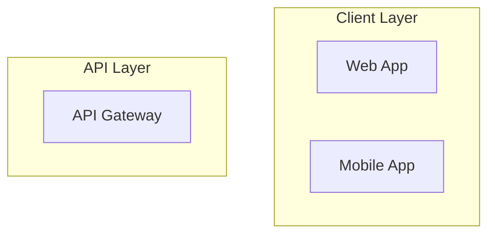

Create a Mermaid architecture diagram for the portfolio management system.

## Components to Include

### Client Layer
- Web Application
- Mobile Application

### API Layer
- API Gateway

### Service Layer
- Authentication Service
- Portfolio Service
- Trading Service
- Notification Service

### Data Layer
- PostgreSQL Database
- Redis Cache

### External
- Market Data Feed

## Requirements

1. **Use subgraphs** to group components by layer
2. **Show data flow** with labeled arrows
3. **Use `graph TD`** for top-down layout
4. **Label all connections** with meaningful descriptions

## Output Format

## Verification

Test the diagram at https://mermaid.live before saving.

## Save To
`outputs/diagrams/portfolio-architecture.md`
