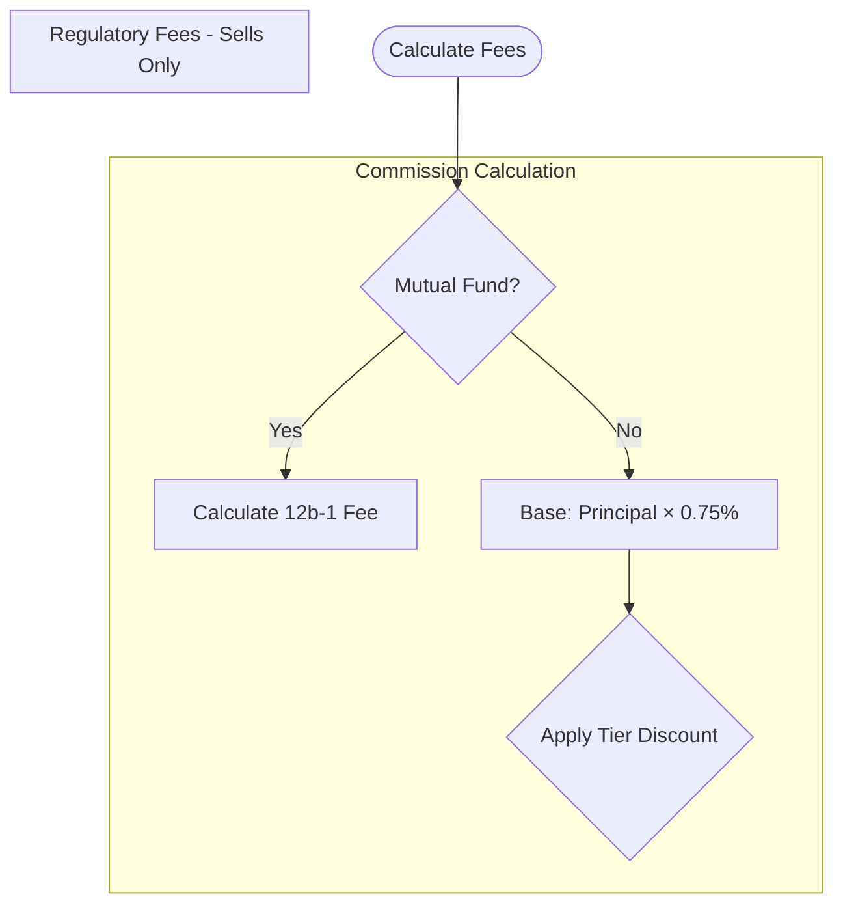

 
Create a Mermaid flowchart showing the fee calculation logic from the TRDSETTL COBOL program.

## Fee Types to Document

### 1. Commission Calculation
- Check if mutual fund (different path - 12b-1 fee)
- Calculate base commission (0.75% of principal)
- Apply tier discount (Tiers 1-6: 0%, 10%, 20%, 35%, 50%, 75%)
- Apply account-level negotiated discount
- Enforce minimum ($4.95) and maximum ($29.95)
- Special case: Zero commission for principal trades

### 2. Regulatory Fees (Sells Only)
- **SEC Fee**: $27.80 per $1,000,000 of principal
- **TAF Fee**: $0.000166 per share, max $8.30 per trade

### 3. Exchange Fees
- NYSE: $0.0003 per share
- NASDAQ: $0.0002 per share
- AMEX: $0.00025 per share
- Other: $0.0001 per share

### 4. Other Fees
- Foreign security fee (ADR): $0.02 per share
- Principal trade markup: 1.5% of principal

### 5. Total Fee Calculation
- Sum all applicable fees

## Requirements

1. **Use subgraphs** to group each fee category
2. **Show decision points** for conditional logic
3. **Include specific values** (rates, limits)
4. **Show the formula flow** clearly
5. **Color-code** success vs. special cases if possible

## Output Format

## Verification

Test the diagram at https://mermaid.live before saving.

## Save To
`outputs/diagrams/fee-calculation-logic.md`
