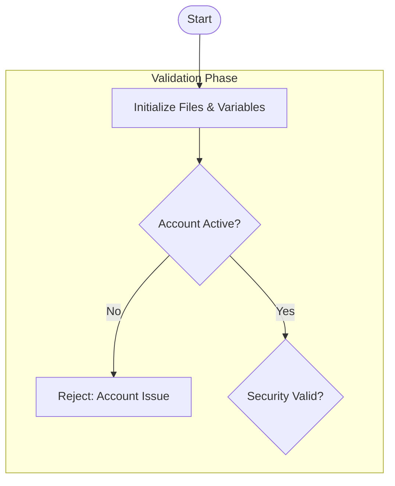

 
Create a Mermaid flowchart showing the main processing flow of the TRDSETTL COBOL program.

## Input

Use the COBOL program or extracted requirements from:
- [inputs/legacy-code/trade-settlement-calc.cbl](../inputs/legacy-code/trade-settlement-calc.cbl)
- Your Lab 1 extracted requirements

## Flow to Document

### Main Processing Phases

1. **Initialization** (1000-INITIALIZE)
   - Open files
   - Initialize variables

2. **Validation Phase** (2000-VALIDATE-TRADE)
   - Account status check (ACTIVE, SUSPENDED, RESTRICTED, CLOSED)
   - Security validation
   - Quantity validation
   - Market hours check

3. **Fee Calculation Phase** (3000-CALC-FEES)
   - Commission calculation with tier discounts
   - SEC fee (sells only)
   - TAF fee (sells only)
   - Exchange fees
   - Foreign security fees

4. **Settlement Date Calculation** (4000-CALC-SETTLEMENT)
   - Determine days based on security type
   - Call DATEUTIL for business days

5. **Margin Rules** (5000-APPLY-MARGIN-RULES)
   - Only for margin accounts
   - Reg-T requirements
   - Maintenance margin

6. **Finalization** (9000-FINALIZE)
   - Write audit record
   - Close files

## Requirements

1. **Use `flowchart TD`** for top-down layout
2. **Use decision diamonds** `{text}` for validations
3. **Show error paths** leading to rejection
4. **Use subgraphs** to group phases
5. **Include key values** (rates, thresholds) in labels
6. **Business language** - not COBOL variable names

## Output Format

## Verification

Test the diagram at https://mermaid.live before saving.

## Save To
`outputs/diagrams/trade-settlement-flow.md`
