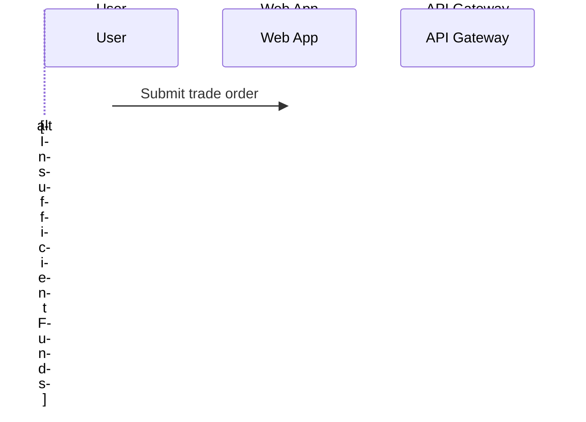

 
Create a Mermaid sequence diagram for the trade execution flow.

## Participants

- User
- Web App
- API Gateway
- Trading Service
- Portfolio Service
agent: diagram-architect

## Flow to Document

### Success Path
1. User submits trade order via Web App
9. Trading Service triggers Notification Service
10. Notification sends confirmation to User
11. Web App displays confirmation

### Error Path (Insufficient Funds)
- Portfolio Service returns insufficient funds
- Trading Service rejects order
- User receives rejection notification

## Requirements

1. **Use `sequenceDiagram`** syntax
2. **Include `alt` block** for insufficient funds scenario
3. **Use proper arrow types**:
   - `->>`  for synchronous requests
   - `-->>` for responses
   - `->>+` and `-->>-` for activation

## Verification

Test the diagram at https://mermaid.live before saving.

## Save To
`outputs/diagrams/trade-execution-sequence.md`
