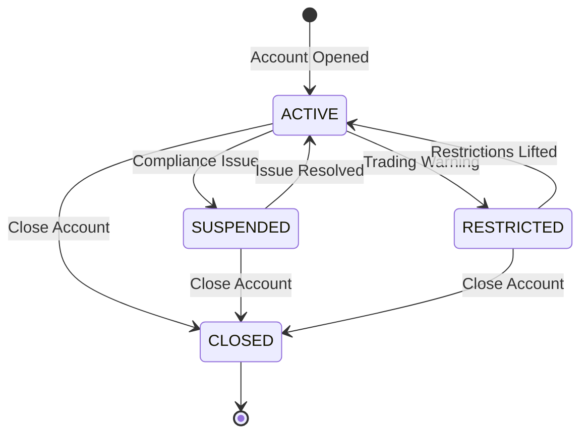

Create Mermaid state diagrams for the TRDSETTL system.

## State Machines to Document

### 1. Account Status States

| State | Description | Allowed Actions |
|-------|-------------|-----------------|
| ACTIVE | Normal trading | Buy, Sell, Short, Cover |
| SUSPENDED | Temporarily frozen | None |
| RESTRICTED | Limited activity | Sell, Cover only (no Buy, Short) |
| CLOSED | Permanently closed | None |

**Transitions:**
- ACTIVE → SUSPENDED (compliance issue, margin call)
- ACTIVE → RESTRICTED (pattern day trader, margin warning)
- SUSPENDED → ACTIVE (issue resolved)
- RESTRICTED → ACTIVE (restrictions lifted)
- Any → CLOSED (account closure)

### 2. Order Processing States (Optional Bonus)

| State | Description |
|-------|-------------|
| CREATED | Order entered |
| VALIDATING | Checking account/security/funds |
| VALIDATED | Passed all checks |
| REJECTED | Failed validation |
| PENDING | Awaiting execution |
| SUBMITTED | Sent to broker |
| PARTIAL_FILL | Partially executed |
| FILLED | Fully executed |
| CANCELLED | User cancelled |
| EXPIRED | Time limit reached |
| FAILED | System error |

## Requirements

1. **Use `stateDiagram-v2`** syntax
2. **Show all valid transitions**
3. **Include guards/conditions** on transitions where applicable
4. **Use composite states** if helpful
5. **Mark terminal states** clearly

## Output Format

## Verification

Test the diagram at https://mermaid.live before saving.

## Save To
`outputs/diagrams/settlement-states.md`
