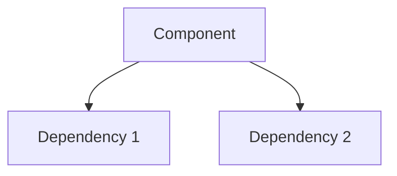
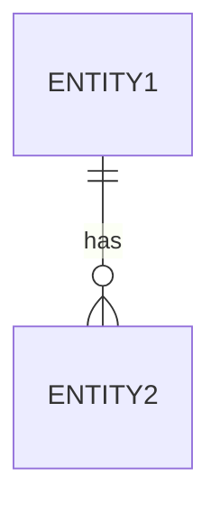
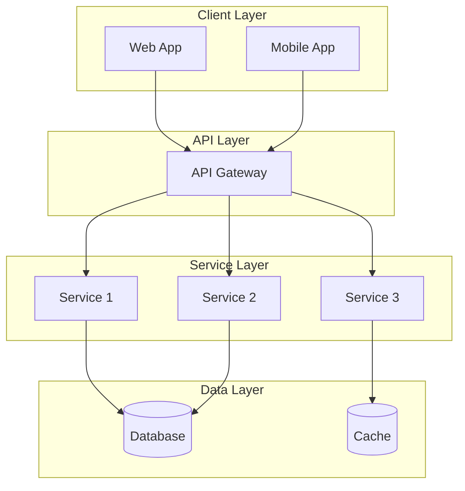
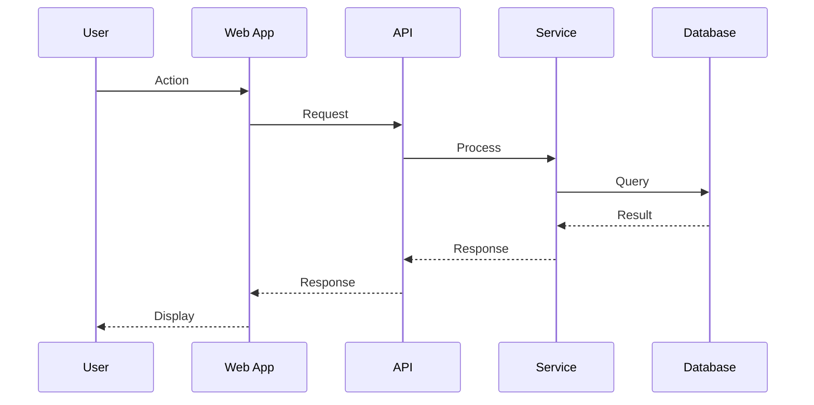
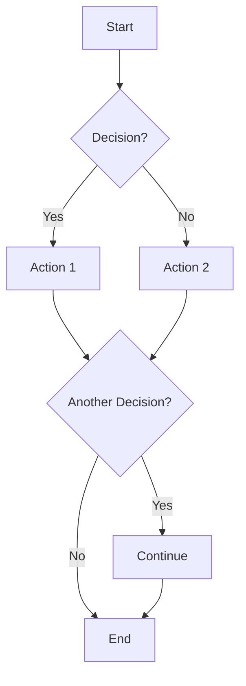
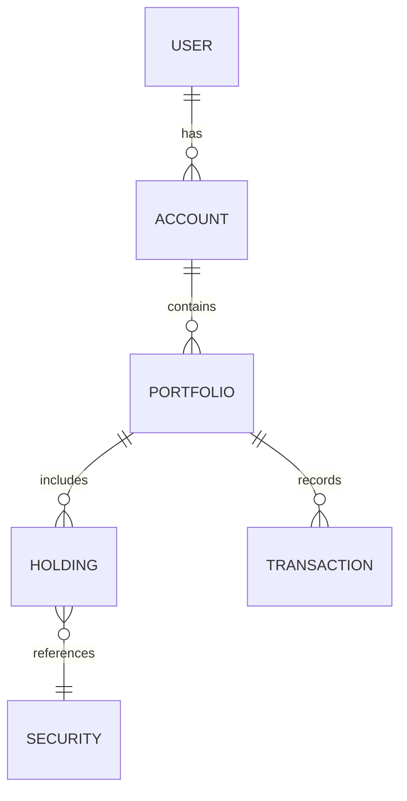
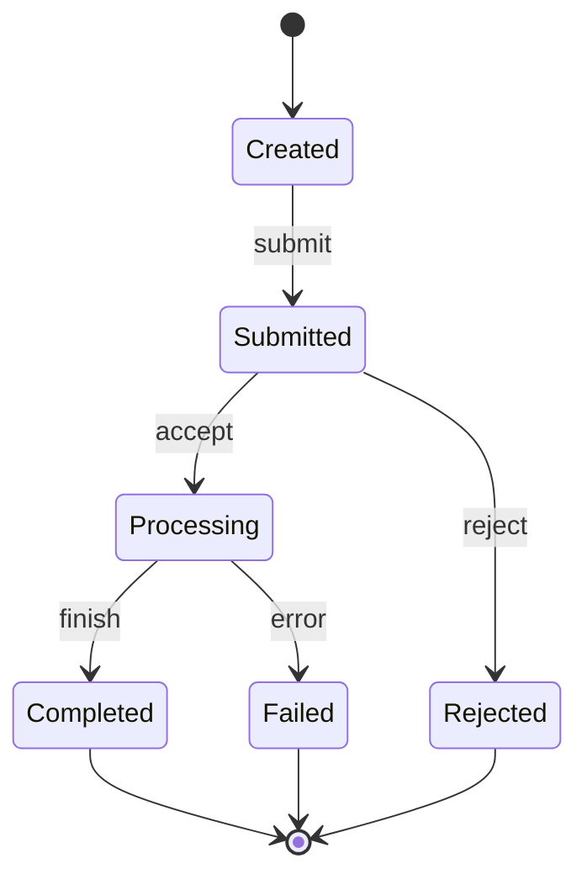
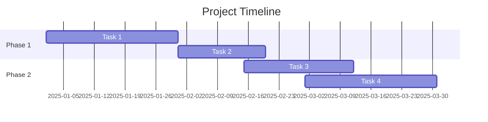

# Lab Build Instructions for Claude Code
## Workshop 4: Analyst Documentation (75 minutes)

**Purpose:** Build a lab environment for practicing AI-assisted documentation creation.

**Lab Repository Name:** `copilot-documentation-lab`

---

## Overview

This lab provides sample materials, templates, and exercises for creating technical documentation and visual artifacts using AI tools. Unlike code-focused labs, this lab emphasizes documentation artifacts.

---

## Build Sequence

### Section 1: Create Directory Structure

```bash
mkdir copilot-documentation-lab
cd copilot-documentation-lab

mkdir -p inputs/{meeting-notes,rough-specs,existing-docs}
mkdir -p templates/{requirements,technical-specs,process-docs,diagrams}
mkdir -p exercises/{lab1-documentation,lab2-diagrams,lab3-review}
mkdir -p outputs/{requirements,specs,diagrams}
mkdir -p examples/{before-after,diagrams,templates}
mkdir -p reference/{terminology,standards}
```

Final structure:
```
copilot-documentation-lab/
├── inputs/
│   ├── meeting-notes/
│   │   ├── portfolio-rebalancing-notes.md
│   │   ├── onboarding-discussion.md
│   │   └── api-planning-notes.md
│   ├── rough-specs/
│   │   └── trade-execution-rough.md
│   └── existing-docs/
│       └── legacy-system-doc.md
├── templates/
│   ├── requirements/
│   │   └── feature-requirements-template.md
│   ├── technical-specs/
│   │   └── technical-spec-template.md
│   ├── process-docs/
│   │   └── process-doc-template.md
│   └── diagrams/
│       └── diagram-templates.md
├── exercises/
│   ├── lab1-documentation/
│   │   └── instructions.md
│   ├── lab2-diagrams/
│   │   └── instructions.md
│   └── lab3-review/
│       └── instructions.md
├── outputs/
│   ├── requirements/
│   ├── specs/
│   └── diagrams/
├── examples/
│   ├── before-after/
│   │   └── documentation-transformation.md
│   ├── diagrams/
│   │   └── sample-diagrams.md
│   └── templates/
├── reference/
│   ├── terminology/
│   │   └── glossary.md
│   └── standards/
│       └── documentation-standards.md
└── README.md
```

---

## Section 2: Create Input Materials

### 2.1 Meeting Notes

Create `inputs/meeting-notes/portfolio-rebalancing-notes.md`:
```markdown
# Portfolio Rebalancing Discussion - Raw Notes
**Date:** Oct 15, 2025
**Attendees:** Sarah (PM), Mike (Dev Lead), Lisa (Analyst)

## Discussion Points

talked about auto rebalancing feature
- users want to set target allocations for their portfolio
- system should suggest trades to get back to target
- maybe quarterly or when drift exceeds threshold?

Mike said need to consider:
- tax implications (dont want to trigger lots of capital gains)
- transaction costs
- minimum trade sizes

Sarah wants:
- dashboard showing current vs target
- email notifications when rebalancing needed
- ability to approve or modify suggested trades

Lisa mentioned compliance:
- need audit trail of all rebalancing decisions
- some accounts may have restrictions
- suitability checks required

open questions:
- what happens if market moves during rebalancing?
- how handle accounts with restrictions?
- integrate with existing trade execution or new?

next steps - need requirements doc for sprint planning

TODO: figure out edge cases for partial fills
```

Create `inputs/meeting-notes/onboarding-discussion.md`:
```markdown
# New Account Onboarding Flow - Brainstorm
**Date:** Oct 12, 2025

Quick notes from whiteboard session:

User fills out application
- personal info (name, address, ssn, dob)
- employment info
- investment experience
- risk tolerance questionnaire

then we need to verify identity
- could use third party service
- upload drivers license?
- selfie matching?

compliance review
- AML checks
- sanctions screening
- PEP check (politically exposed person)

if everything passes -> account approved
if issues -> manual review queue

account funding
- link bank account (plaid?)
- initial deposit
- wire transfer option for large amounts

after funding
- welcome email
- tutorial prompts
- assign to advisor if managed account

timeline goals:
- simple accounts: same day
- complex: 3-5 business days

pain points with current process:
- too many steps
- users abandon at identity verification
- manual review backlog
```

Create `inputs/meeting-notes/api-planning-notes.md`:
```markdown
# Portfolio API Planning
**Date:** Oct 10, 2025

## New endpoints needed

GET /portfolios/{id}/performance
- returns performance metrics
- time periods: 1d, 1w, 1m, 3m, 6m, 1y, ytd, all
- include benchmark comparison
- return absolute and percentage returns

GET /portfolios/{id}/holdings
- list all positions
- include current value, cost basis, gain/loss
- support sorting and filtering
- pagination for large portfolios

POST /portfolios/{id}/rebalance
- submit rebalancing request
- include target allocations
- return proposed trades
- status: pending, approved, executed

GET /portfolios/{id}/transactions
- transaction history
- filter by date range, type
- include dividends, fees

Security:
- all endpoints need auth
- rate limiting
- audit logging

Error handling:
- standard error format
- meaningful error codes
- don't expose internal details
```

### 2.2 Rough Specs

Create `inputs/rough-specs/trade-execution-rough.md`:
```markdown
# Trade Execution - Rough Spec

## Overview
System to execute trades for client portfolios

## Basic Flow
1. User or system creates order
2. Validate order (funds, restrictions, market hours)
3. Route to appropriate exchange/broker
4. Monitor for fills
5. Update portfolio on execution
6. Send confirmation

## Order Types
- Market
- Limit  
- Stop
- Stop Limit

## Validations needed
- Sufficient funds/shares
- Account not restricted
- Security is tradeable
- Market is open (or allow after hours)
- Order size within limits

## Status flow
Created -> Validated -> Submitted -> Partial Fill -> Filled
                    \-> Rejected
                     \-> Cancelled

## Integrations
- Market data feed for prices
- Broker API for execution
- Compliance system for restrictions
- Notification service for confirmations

## Performance
- Order submission < 100ms
- Status updates real-time via websocket

## Questions
- How handle partial fills?
- Retry logic for failed submissions?
- End of day handling for unfilled orders?
```

### 2.3 Existing Documentation (for improvement)

Create `inputs/existing-docs/legacy-system-doc.md`:
```markdown
# Account System

The account system manages accounts. Users have accounts and accounts have portfolios.

## Database

There is a database with tables. The main tables are users, accounts, and portfolios. Also transactions.

## API

The API has endpoints. You can get accounts and create accounts. Also update and delete.

GET /accounts - gets accounts
POST /accounts - makes new account
PUT /accounts/{id} - updates it
DELETE /accounts/{id} - removes account

## Authentication

Users login with username and password. Then they get a token. The token is used for API calls.

## Error Handling

Errors return error messages. Different codes for different errors.

## Notes

The system was built in 2019. It uses Java. There are some known issues that should be fixed eventually.

Contact Bob for questions.
```

---

## Section 3: Create Templates

### 3.1 Requirements Template

Create `templates/requirements/feature-requirements-template.md`:
```markdown
# Feature Requirements: [Feature Name]

**Version:** [X.X]
**Author:** [Name]
**Date:** [Date]
**Status:** [Draft/Review/Approved]

---

## 1. Overview

### 1.1 Purpose
[2-3 sentences describing what this feature does and why]

### 1.2 Scope
**In Scope:**
- [Item 1]
- [Item 2]

**Out of Scope:**
- [Item 1]
- [Item 2]

### 1.3 Stakeholders
| Role | Name | Responsibility |
|------|------|----------------|
| Product Owner | | Approval |
| Tech Lead | | Technical review |
| QA Lead | | Test planning |

---

## 2. User Stories

### US-001: [Story Title]
**As a** [user type]
**I want** [action]
**So that** [benefit]

**Acceptance Criteria:**
- [ ] [Criterion 1]
- [ ] [Criterion 2]
- [ ] [Criterion 3]

**Priority:** [High/Medium/Low]
**Estimate:** [Story points or days]

---

### US-002: [Story Title]
[Repeat format]

---

## 3. Business Rules

| ID | Rule | Description |
|----|------|-------------|
| BR-001 | | |
| BR-002 | | |

---

## 4. Non-Functional Requirements

### 4.1 Performance
- [Requirement]

### 4.2 Security
- [Requirement]

### 4.3 Scalability
- [Requirement]

---

## 5. Dependencies

| Dependency | Type | Owner | Status |
|------------|------|-------|--------|
| | External/Internal | | |

---

## 6. Assumptions

1. [Assumption 1]
2. [Assumption 2]

---

## 7. Risks

| Risk | Probability | Impact | Mitigation |
|------|-------------|--------|------------|
| | High/Med/Low | High/Med/Low | |

---

## 8. Appendix

### 8.1 Glossary
| Term | Definition |
|------|------------|
| | |

### 8.2 References
- [Reference 1]

---

## Document History

| Version | Date | Author | Changes |
|---------|------|--------|---------|
| 0.1 | | | Initial draft |
```

### 3.2 Technical Spec Template

Create `templates/technical-specs/technical-spec-template.md`:
```markdown
# Technical Specification: [Component/Feature Name]

**Version:** [X.X]
**Author:** [Name]
**Date:** [Date]
**Status:** [Draft/Review/Approved]

---

## 1. Overview

### 1.1 Purpose
[What this component does]

### 1.2 Background
[Context and why this is needed]

### 1.3 Goals
- [Goal 1]
- [Goal 2]

### 1.4 Non-Goals
- [Non-goal 1]

---

## 2. System Context

### 2.1 Architecture Diagram
[DIAGRAM: System context showing this component and its interactions]



### 2.2 Dependencies
| System | Purpose | Interface |
|--------|---------|-----------|
| | | |

---

## 3. Detailed Design

### 3.1 Data Model

#### Entities
[DIAGRAM: ER diagram]



#### Schema
```sql
CREATE TABLE entity (
    id UUID PRIMARY KEY,
    -- fields
);
```

### 3.2 API Design

#### Endpoints

##### GET /resource
**Purpose:** [Description]

**Request:**
```
Headers:
  Authorization: Bearer {token}
  
Query Parameters:
  - param1 (optional): description
```

**Response:**
```json
{
  "data": [],
  "pagination": {}
}
```

**Error Codes:**
| Code | Meaning |
|------|---------|
| 400 | Invalid request |
| 401 | Unauthorized |
| 404 | Not found |

---

## 4. Security Considerations

### 4.1 Authentication
[How users are authenticated]

### 4.2 Authorization
[Access control approach]

### 4.3 Data Protection
[Encryption, PII handling]

---

## 5. Performance Requirements

| Metric | Target | Measurement |
|--------|--------|-------------|
| Response time | <200ms | P95 |
| Throughput | 1000 req/s | Peak |

---

## 6. Error Handling

### 6.1 Error Response Format
```json
{
  "error": {
    "code": "ERROR_CODE",
    "message": "Human readable message",
    "details": {}
  }
}
```

### 6.2 Error Codes
| Code | HTTP Status | Description | Action |
|------|-------------|-------------|--------|
| | | | |

---

## 7. Testing Strategy

### 7.1 Unit Tests
- [Coverage targets]

### 7.2 Integration Tests
- [Key scenarios]

### 7.3 Performance Tests
- [Load testing approach]

---

## 8. Deployment

### 8.1 Configuration
| Setting | Default | Description |
|---------|---------|-------------|
| | | |

### 8.2 Rollout Plan
1. [Step 1]
2. [Step 2]

---

## 9. Monitoring

### 9.1 Metrics
- [Metric 1]
- [Metric 2]

### 9.2 Alerts
| Alert | Condition | Severity |
|-------|-----------|----------|
| | | |

---

## 10. Open Questions

1. [Question 1]
2. [Question 2]

---

## Document History

| Version | Date | Author | Changes |
|---------|------|--------|---------|
| 0.1 | | | Initial draft |
```

### 3.3 Diagram Templates

Create `templates/diagrams/diagram-templates.md`:
```markdown
# Mermaid Diagram Templates

## 1. System Architecture



## 2. Sequence Diagram



## 3. Flowchart



## 4. Entity Relationship



## 5. State Diagram



## 6. Gantt Chart


```

---

## Section 4: Create Exercise Files

### 4.1 Lab 1 Instructions

Create `exercises/lab1-documentation/instructions.md`:
```markdown
# Lab 1: Creating Technical Documentation

## Objective
Transform rough meeting notes into professional documentation using AI assistance.

## Duration
15 minutes

## Input Materials
Use the meeting notes in `inputs/meeting-notes/portfolio-rebalancing-notes.md`

---

## Task 1: Requirements Document (8 minutes)

### Instructions
1. Open the portfolio rebalancing meeting notes
2. Use this AI prompt template:

```
Transform these meeting notes into a professional requirements document:

[Paste meeting notes]

Create:
1. Feature overview (2-3 sentences)
2. 3-5 user stories with acceptance criteria
3. Business rules extracted from discussion
4. Assumptions based on context
5. Open questions that need resolution

Format: Use the template structure from templates/requirements/
Tone: Professional, clear for development team
```

3. Review and refine the output
4. Save to `outputs/requirements/portfolio-rebalancing-requirements.md`

### Deliverable Checklist
- [ ] Clear feature overview
- [ ] At least 3 user stories with acceptance criteria
- [ ] Business rules documented
- [ ] Assumptions listed
- [ ] Open questions captured

---

## Task 2: Technical Spec Outline (7 minutes)

### Instructions
1. Using your requirements document as input
2. Use this AI prompt:

```
Based on this requirements document, create a technical specification outline:

[Paste requirements]

Include:
1. System context - what components are involved
2. Data model - what entities are needed
3. API contracts - key endpoints
4. Placeholder for architecture diagram: [DIAGRAM: description]
5. Key technical decisions to be made

Format: Markdown with clear sections
Note: This is an outline, not full detail
```

3. Save to `outputs/specs/portfolio-rebalancing-spec-outline.md`

### Deliverable Checklist
- [ ] System context described
- [ ] Data entities identified
- [ ] API endpoints outlined
- [ ] Diagram placeholders included
- [ ] Technical decisions listed

---

## Quality Check

Use this prompt to review your work:
```
Review this documentation for:
1. Completeness - any missing sections?
2. Clarity - any ambiguous language?
3. Consistency - terminology consistent?
4. Actionability - can dev team use this?

Provide specific improvement suggestions.
```
```

### 4.2 Lab 2 Instructions

Create `exercises/lab2-diagrams/instructions.md`:
```markdown
# Lab 2: Creating Visual Diagrams

## Objective
Create professional diagrams using AI-generated Mermaid syntax.

## Duration
15 minutes

---

## Task 1: Architecture Diagram (5 minutes)

### Scenario
Create an architecture diagram for the portfolio management system.

### Components to Include
- Web Application
- Mobile Application  
- API Gateway
- Authentication Service
- Portfolio Service
- Trading Service
- Notification Service
- PostgreSQL Database
- Redis Cache
- External: Market Data Feed

### AI Prompt
```
Create a Mermaid architecture diagram for a portfolio management system:

Components:
- Web App and Mobile App (client layer)
- API Gateway (routing layer)
- Auth Service, Portfolio Service, Trading Service, Notification Service
- PostgreSQL database, Redis cache
- External market data feed integration

Requirements:
- Group components by layer
- Show data flow directions
- Label all connections
- Use subgraphs for logical grouping

Output: Valid Mermaid graph TD syntax
```

### Deliverable
Save diagram to `outputs/diagrams/portfolio-architecture.md`

Verify it renders correctly at https://mermaid.live

---

## Task 2: Sequence Diagram (5 minutes)

### Scenario
Create a sequence diagram for the trade execution flow.

### Flow to Document
1. User initiates trade in Web App
2. Request goes through API Gateway
3. Trading Service validates order
4. Trading Service checks with Portfolio Service for funds
5. Trading Service submits to external broker
6. On success: update portfolio, send notification
7. Return confirmation to user

### AI Prompt
```
Create a Mermaid sequence diagram for trade execution:

Participants:
- User
- Web App
- API Gateway
- Trading Service
- Portfolio Service
- External Broker
- Notification Service

Flow:
1. User submits trade order
2. Validate order details
3. Check available funds
4. Submit to broker
5. Receive execution confirmation
6. Update portfolio
7. Send notification
8. Return confirmation to user

Include:
- Success path with all steps
- Alt block for insufficient funds scenario
- Proper arrow types (sync vs async)
```

### Deliverable
Save to `outputs/diagrams/trade-execution-sequence.md`

---

## Task 3: Process Flowchart (5 minutes)

### Scenario
Create a flowchart for new account onboarding.

### Process to Document
Based on `inputs/meeting-notes/onboarding-discussion.md`:
- Application submission
- Identity verification
- Compliance checks
- Manual review (if needed)
- Account approval/rejection
- Account funding
- Welcome process

### AI Prompt
```
Create a Mermaid flowchart for account onboarding:

Steps:
1. User submits application
2. System validates required fields
3. Identity verification (pass/fail)
4. Compliance checks (AML, sanctions, PEP)
5. Decision: auto-approve or manual review
6. Manual review queue (if needed)
7. Final decision: approve or reject
8. If approved: account funding
9. Welcome email and onboarding

Include:
- Diamond shapes for decisions
- Multiple end states (approved, rejected, abandoned)
- Clear labels on all paths
```

### Deliverable
Save to `outputs/diagrams/onboarding-flowchart.md`

---

## Verification

For each diagram:
1. Paste into https://mermaid.live
2. Verify it renders without errors
3. Check all labels are readable
4. Confirm flow is logical
```

### 4.3 Lab 3 Instructions

Create `exercises/lab3-review/instructions.md`:
```markdown
# Lab 3: Documentation Review

## Objective
Review and improve documentation using AI-assisted quality checks.

## Duration
5 minutes

---

## Task: Quality Review

### Instructions

1. Gather your outputs from Lab 1 and Lab 2

2. Use this comprehensive review prompt:

```
Review these documentation artifacts for quality:

## Requirements Document:
[Paste your requirements doc]

## Technical Spec Outline:
[Paste your spec outline]

## Diagrams:
[Paste your Mermaid diagrams]

Evaluate each for:

1. COMPLETENESS
   - Any missing sections?
   - Any TBD items that should be filled?
   - Coverage of the original requirements?

2. CLARITY
   - Any ambiguous language?
   - Technical terms defined?
   - Readable by intended audience?

3. CONSISTENCY
   - Same terminology throughout?
   - Matching between docs and diagrams?
   - Consistent formatting?

4. ACCURACY
   - Diagrams match described flow?
   - Requirements align with spec?
   - Any contradictions?

For each issue found:
- Location (which document, which section)
- Issue description
- Suggested fix

Overall quality score: X/10
Top 3 improvements to make:
```

3. Address the top issues identified

4. Re-run review to verify improvements

---

## Quality Checklist

Before considering documentation complete:

- [ ] All sections filled (no TBD/TODO)
- [ ] Terminology consistent across docs
- [ ] Diagrams match text descriptions
- [ ] Audience-appropriate language
- [ ] Version and date included
- [ ] Author identified
- [ ] Reviewed by at least one other person

---

## Deliverable

Create a brief review summary:
- Issues found: X
- Issues fixed: X
- Remaining items: X
- Overall quality: X/10
```

---

## Section 5: Create Examples

### 5.1 Before/After Example

Create `examples/before-after/documentation-transformation.md`:
```markdown
# Documentation Transformation Example

## BEFORE: Raw Meeting Notes

```
talked about the dashboard today
- needs to show portfolio value
- maybe a chart?
- sarah wants to see gains/losses
- mike said api already has the data
- need to figure out refresh rate
- mobile too or just web?
```

## AFTER: Requirements Document

# Dashboard Feature Requirements

## 1. Overview

### 1.1 Purpose
Provide users with an at-a-glance view of their portfolio performance, including current value, gains/losses, and historical trends. This feature addresses user feedback requesting easier access to key portfolio metrics.

### 1.2 Scope
**In Scope:**
- Portfolio value display with real-time updates
- Gain/loss visualization (absolute and percentage)
- Historical performance chart
- Web application implementation

**Out of Scope:**
- Mobile application (Phase 2)
- Customizable dashboard layouts
- Third-party widget integrations

---

## 2. User Stories

### US-001: View Portfolio Value
**As a** portfolio owner
**I want** to see my current portfolio value on the dashboard
**So that** I can quickly understand my financial position

**Acceptance Criteria:**
- [ ] Dashboard displays total portfolio value prominently
- [ ] Value updates within 15 seconds of market changes
- [ ] Currency formatting matches user preferences
- [ ] Loading state shown during data fetch

**Priority:** High
**Estimate:** 3 points

### US-002: View Gains and Losses
**As a** portfolio owner
**I want** to see my gains and losses on the dashboard
**So that** I can track my investment performance

**Acceptance Criteria:**
- [ ] Shows absolute gain/loss in currency
- [ ] Shows percentage gain/loss
- [ ] Green color for gains, red for losses
- [ ] Timeframe selector (day, week, month, year, all-time)

**Priority:** High
**Estimate:** 5 points

### US-003: View Performance Chart
**As a** portfolio owner
**I want** to see a historical performance chart
**So that** I can visualize trends over time

**Acceptance Criteria:**
- [ ] Line chart showing portfolio value over time
- [ ] Selectable timeframes (1W, 1M, 3M, 6M, 1Y, ALL)
- [ ] Benchmark comparison option (S&P 500)
- [ ] Hover to see specific date values

**Priority:** Medium
**Estimate:** 8 points

---

## 3. Technical Notes

### 3.1 Data Source
- Existing Portfolio API provides required data
- Endpoint: GET /portfolios/{id}/performance
- Real-time updates via WebSocket connection

### 3.2 Refresh Rate
- Initial load: On page load
- Background refresh: Every 15 seconds during market hours
- Manual refresh: User-triggered

---

## 4. Open Questions

1. Should we cache performance data client-side?
2. What's the fallback if WebSocket connection fails?
3. Mobile timeline - when should Phase 2 begin?

---

## Key Improvements Made:

1. **Structure**: Organized into clear sections
2. **Specificity**: Vague ideas became detailed acceptance criteria
3. **Completeness**: Added scope, technical notes, questions
4. **Actionability**: Development team can estimate and build from this
```

---

## Section 6: Create Reference Materials

### 6.1 Glossary

Create `reference/terminology/glossary.md`:
```markdown
# Portfolio Management Glossary

## A

**AML (Anti-Money Laundering)**
Regulations and procedures to prevent money laundering activities.

**Asset Allocation**
The distribution of investments across asset classes (stocks, bonds, cash).

## B

**Benchmark**
A standard against which portfolio performance is measured (e.g., S&P 500).

## C

**Cost Basis**
The original purchase price of an investment, used for calculating gains/losses.

## D

**Dividend**
A distribution of company profits to shareholders.

**Drift**
The difference between current allocation and target allocation.

## G

**Gain/Loss**
The difference between current value and cost basis.

## H

**Holding**
An individual investment position within a portfolio.

## K

**KYC (Know Your Customer)**
Verification process to confirm client identity.

## M

**Market Order**
An order to buy or sell immediately at current market price.

## P

**PEP (Politically Exposed Person)**
Individuals with prominent public functions requiring enhanced due diligence.

**Portfolio**
A collection of investments owned by an individual or entity.

## R

**Rebalancing**
Adjusting portfolio holdings to maintain target allocation.

## T

**Transaction**
A buy, sell, or transfer of securities.

## Y

**YTD (Year-to-Date)**
Performance from January 1 to current date.
```

### 6.2 Documentation Standards

Create `reference/standards/documentation-standards.md`:
```markdown
# Documentation Standards

## 1. General Principles

### 1.1 Audience First
- Identify your audience before writing
- Adjust technical depth accordingly
- Define terms that may be unfamiliar

### 1.2 Clear and Concise
- Use active voice
- Keep sentences under 25 words
- One idea per paragraph

### 1.3 Scannable
- Use headers and subheaders
- Include bullet points for lists
- Add tables for comparisons

## 2. Required Sections

### All Documents Must Include:
- Title
- Version number
- Author
- Date
- Status (Draft/Review/Approved)

### Requirements Documents:
- Overview
- User stories with acceptance criteria
- Business rules
- Assumptions
- Open questions

### Technical Specifications:
- Purpose
- Architecture diagram
- Data model
- API contracts
- Security considerations

## 3. Formatting Standards

### Headers
- Use sentence case: "User authentication flow"
- Not: "User Authentication Flow"

### Lists
- Use bullets for unordered items
- Use numbers for sequential steps
- Maintain parallel structure

### Code Examples
- Use fenced code blocks with language
- Include comments for complex sections
- Show both request and response for APIs

### Diagrams
- Include title/caption
- Use consistent notation
- Provide text description for accessibility

## 4. Review Checklist

Before publishing:
- [ ] Spell check completed
- [ ] Links verified
- [ ] Diagrams render correctly
- [ ] Technical accuracy confirmed by SME
- [ ] No placeholder text remaining
- [ ] Version number updated
```

---

## Section 7: Create README

Create `README.md`:
```markdown
# Copilot Documentation Lab

Workshop lab for AI-assisted documentation creation.

## Getting Started

This lab contains materials for practicing documentation creation using AI tools.

## Structure

```
├── inputs/          # Raw materials to transform
├── templates/       # Documentation templates
├── exercises/       # Lab instructions
├── outputs/         # Your completed work
├── examples/        # Before/after examples
└── reference/       # Standards and terminology
```

## Labs

### Lab 1: Creating Technical Documentation (15 min)
Transform meeting notes into professional requirements and specs.

### Lab 2: Creating Diagrams (15 min)
Generate Mermaid diagrams for architecture, sequences, and flows.

### Lab 3: Documentation Review (5 min)
Quality check your documentation using AI assistance.

## Tools

- AI Assistant (Claude/Copilot)
- Mermaid Live Editor: https://mermaid.live
- Markdown preview

## Tips

1. Start with the templates for structure
2. Use specific prompts for better output
3. Always review AI output for accuracy
4. Check diagrams render before sharing
```

---

## Verification Checklist

- [ ] All input files contain realistic content
- [ ] Templates are comprehensive and usable
- [ ] Exercise instructions are clear
- [ ] Examples demonstrate transformation
- [ ] Reference materials are accurate
- [ ] Mermaid diagrams render correctly

---

**End of Lab Build Instructions**
