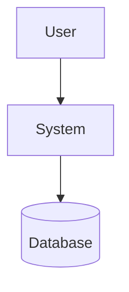
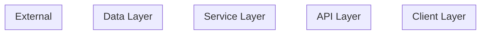
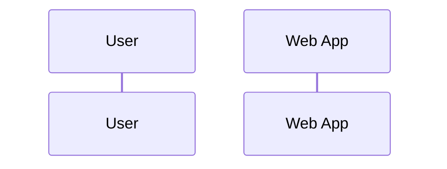
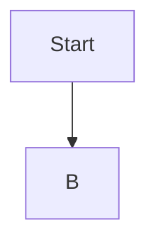

# GenAI DevAssist | Analyst Documentation
## Participant Guide v1.0

**Version:** 1.0  
**Duration:** 75 minutes  
**Fidelity DevAssist Program**

---

## Table of Contents

1. [Workshop Overview](#workshop-overview)
2. [Documentation Prompt Templates](#documentation-prompt-templates)
3. [Lab 1: Creating Technical Documentation](#lab-1-creating-technical-documentation)
4. [Lab 2: Creating Diagrams](#lab-2-creating-diagrams)
5. [Lab 3: Documentation Review](#lab-3-documentation-review)
6. [Quick Reference Guide](#quick-reference-guide)
7. [Homework](#homework)

---

## Workshop Overview

### Learning Objectives

By completing this workshop, you will be able to:

1. **Create** clear technical documentation using AI-powered tools
2. **Design** system architecture, sequence, and workflow diagrams
3. **Evaluate** documentation for quality and consistency
4. **Produce** visual artifacts that enhance stakeholder communication

### Workshop Agenda

| Time | Section | Duration |
|------|---------|----------|
| 0:00 | Opening & Documentation Value | 5 min |
| 0:05 | AI-Powered Documentation Basics | 12 min |
| 0:17 | **Lab 1:** Creating Technical Documentation | 15 min |
| 0:32 | Visual Artifacts with GenAI | 13 min |
| 0:45 | **Lab 2:** Creating Diagrams | 15 min |
| 1:00 | Documentation Standards & Consistency | 8 min |
| 1:08 | **Lab 3:** Documentation Review | 5 min |
| 1:13 | Wrap-up & Next Steps | 2 min |

---

## Documentation Prompt Templates

### Requirements Document Prompt
```
Create a requirements document for [feature name]:

Audience: [who will read this]
Purpose: [what they need to accomplish]

Include:
1. Feature overview (2-3 sentences)
2. User stories with acceptance criteria
3. Business rules
4. Out of scope items
5. Dependencies and assumptions

Format: Markdown with clear headers
Tone: [technical/business/user-friendly]
```

### Technical Specification Prompt
```
Create a technical specification for [component]:

Include:
1. Purpose and scope
2. System context (what it interacts with)
3. Data model (entities and relationships)
4. API contracts (endpoints, request/response)
5. Error handling approach
6. Security considerations

Format: Markdown with code blocks
Add placeholders: [DIAGRAM: description]
```

### Documentation Improvement Prompt
```
Review and improve this documentation:

[paste existing doc]

Improve:
1. Clarity - simplify complex sentences
2. Completeness - identify gaps
3. Structure - reorganize for flow
4. Consistency - standardize terms

Preserve: Technical accuracy
Flag: Items needing SME review
```

---

## Lab 1: Creating Technical Documentation

### Objective
Transform rough meeting notes into professional documentation.

**Duration:** 15 minutes

### Input: Meeting Notes

```markdown
# Portfolio Rebalancing Feature - Meeting Notes
Date: Nov 15, 2024

sarah: ok so we need the rebalancing thing for q1
mike: what exactly does that mean?
sarah: like when portfolio drifts from target allocation, fix it automatically
lisa: so user sets target like 60% stocks 40% bonds?
sarah: yes exactly and system checks periodically
mike: how often?
sarah: daily i think? or maybe weekly? lets say configurable
tom: what about tax implications
sarah: good point, should consider tax lots, minimize taxable events
mike: thats complex. MVP or later?
sarah: mmm lets do basic rebalancing first, tax optimization phase 2
lisa: what triggers it? just drift or user can do manual too?
sarah: both. threshold based automatic + manual button
mike: whats the threshold
sarah: maybe 5%? but configurable per user preference
tom: need to handle partial fills, market closed, etc
mike: yes good point, lots of edge cases
sarah: lets document main flow first
tom: dont forget we need to notify user before executing
sarah: right! user approval required. unless they set auto-approve
mike: that sounds like two modes then
sarah: yes. suggest mode (needs approval) and auto mode (just does it)
lisa: any limits?
sarah: min rebalance amount $100, max daily trades maybe?
```

---

### Task 1: Requirements Document (8 min)

**Your Prompt:**
```
Transform these meeting notes into a requirements document:

[paste meeting notes above]

Include:
1. Feature overview (2-3 sentences)
2. 3-5 user stories with acceptance criteria
3. Business rules as a table
4. Out of scope items
5. Assumptions

Format: Markdown
Audience: Development team
```

**Your Output:**

```markdown
# Portfolio Rebalancing Requirements

## 1. Overview
[Paste AI output here]


## 2. User Stories

### US-001: [Title]
**As a** [user type]
**I want** [capability]
**So that** [benefit]

**Acceptance Criteria:**
- [ ] 
- [ ] 
- [ ] 

---

### US-002: [Title]
**As a** [user type]
**I want** [capability]
**So that** [benefit]

**Acceptance Criteria:**
- [ ] 
- [ ] 

---

### US-003: [Title]
**As a** [user type]
**I want** [capability]
**So that** [benefit]

**Acceptance Criteria:**
- [ ] 
- [ ] 

---

## 3. Business Rules

| ID | Rule | Description |
|----|------|-------------|
| BR-001 | | |
| BR-002 | | |
| BR-003 | | |

---

## 4. Out of Scope
- 
- 
- 

## 5. Assumptions
- 
- 

```

---

### Task 2: Technical Spec Outline (7 min)

**Your Prompt:**
```
Create a technical specification outline for portfolio rebalancing:

Based on the requirements above, include:
1. System context - what components are involved
2. Data model - key entities needed
3. API endpoints - operations to expose
4. Processing flow - high level sequence

Add diagram placeholders: [DIAGRAM: description]
Format: Markdown with sections
```

**Your Output:**

```markdown
# Portfolio Rebalancing - Technical Specification

## 1. System Context
[Paste AI output here]

[DIAGRAM: System context showing components]

---

## 2. Data Model

### Entities
| Entity | Key Fields | Purpose |
|--------|------------|---------|
| | | |
| | | |
| | | |

[DIAGRAM: Entity relationship diagram]

---

## 3. API Endpoints

### [Endpoint 1]
- **Method:** 
- **Path:** 
- **Purpose:** 

### [Endpoint 2]
- **Method:** 
- **Path:** 
- **Purpose:** 

---

## 4. Processing Flow

[DIAGRAM: Sequence diagram for rebalancing]

**Steps:**
1. 
2. 
3. 
4. 

```

---

## Lab 2: Creating Diagrams

### Objective
Create visual documentation using AI-generated Mermaid diagrams.

**Duration:** 15 minutes

### Mermaid Basics

Mermaid is a text-based diagramming language. Example:


**Viewing Diagrams:**
- VS Code: Install "Mermaid Preview" extension
- Web: https://mermaid.live
- GitHub: Renders automatically in markdown

---

### Task 1: Architecture Diagram (5 min)

**Your Prompt:**
```
Create a Mermaid architecture diagram for a portfolio management system:

Components:
- Web Application (Angular)
- Mobile App (React Native)
- API Gateway
- Portfolio Service
- Transaction Service
- Notification Service
- PostgreSQL Database
- Redis Cache
- External: Market Data Feed

Requirements:
- User entry points at top
- Group backend services
- Show data stores at bottom
- Indicate external integrations

Use graph TD with subgraphs and clear labels.
```

**Your Diagram:**



**Renders correctly?** ☐ Yes  ☐ No (fix syntax)

---

### Task 2: Sequence Diagram (5 min)

**Your Prompt:**
```
Create a Mermaid sequence diagram for "User Places a Trade":

Actors:
- User
- Web App
- API Gateway
- Portfolio Service
- Transaction Service
- Market Data Service

Flow:
1. User submits trade order
2. Validate order details
3. Check available balance
4. Get current market price
5. Execute trade
6. Update portfolio
7. Confirm to user

Include error path for insufficient funds.
```

**Your Diagram:**



**Renders correctly?** ☐ Yes  ☐ No

---

### Task 3: Flowchart (5 min)

**Your Prompt:**
```
Create a Mermaid flowchart for "New Account Onboarding":

Steps:
1. Customer starts application
2. Collect personal information
3. Verify identity (KYC)
4. Compliance review
5. Account approval
6. Account creation
7. Welcome notification

Decision points:
- Identity verified? (Yes → continue, No → request documents)
- Compliance approved? (Yes → create, No → manual review)

Use proper flowchart symbols (diamonds for decisions).
```

**Your Diagram:**



**Renders correctly?** ☐ Yes  ☐ No

---

## Lab 3: Documentation Review

### Objective
Review your documentation for quality and consistency.

**Duration:** 5 minutes

### Quality Review Prompt
```
Review this documentation for quality:

[paste your requirements doc from Lab 1]

Check for:
1. Completeness - any missing sections?
2. Clarity - any confusing language?
3. Consistency - terminology correct?
4. Actionability - are requirements testable?
5. Structure - proper formatting?

Provide:
- Quality score (1-10)
- Top 3 issues found
- Improvement suggestions
```

### Your Quality Assessment

**Quality Score:** ___ /10

**Issues Found:**
1. ________________________________
2. ________________________________
3. ________________________________

**Improvements to Make:**
1. ________________________________
2. ________________________________

---

### Documentation Quality Checklist

**Requirements Document:**
- [ ] Has clear purpose statement
- [ ] Audience defined
- [ ] User stories follow standard format
- [ ] Acceptance criteria are testable
- [ ] Business rules complete
- [ ] No TBD or placeholder content
- [ ] Consistent terminology

**Technical Specification:**
- [ ] System context clear
- [ ] Data model defined
- [ ] APIs documented
- [ ] Diagram placeholders included
- [ ] Security considered

**Diagrams:**
- [ ] All components labeled
- [ ] Flows are logical
- [ ] Renders correctly
- [ ] Appropriate level of detail

---

## Quick Reference Guide

### Prompt Structure
```
Create a [document-type] for [subject]:

Audience: [who reads this]
Purpose: [what they do with it]

Include:
1. [Section 1]
2. [Section 2]
3. [Section 3]

Format: [markdown/confluence/etc]
Tone: [technical/business/friendly]
Length: [brief/detailed]
```

### Mermaid Syntax Quick Reference

**Graph (Architecture):**
```
graph TD
    A[Box] --> B(Rounded)
    B --> C[(Database)]
    C --> D{Decision}
```

**Sequence:**
```
sequenceDiagram
    Actor1->>Actor2: Message
    Actor2-->>Actor1: Response
```

**Flowchart:**
```
flowchart TD
    A[Start] --> B{Decision}
    B -->|Yes| C[Action]
    B -->|No| D[Other]
```

### Common Diagram Symbols
| Symbol | Mermaid | Meaning |
|--------|---------|---------|
| Rectangle | `[text]` | Process/Component |
| Rounded | `(text)` | Process |
| Diamond | `{text}` | Decision |
| Cylinder | `[(text)]` | Database |
| Circle | `((text))` | Start/End |

---

## Homework

### Required (Due in 1 week)

#### 1. Create Feature Documentation
Select an upcoming feature and create:
- Requirements document using AI
- Include 3+ user stories

**Feature:** ________________________________

**Completed:** ☐ Yes  ☐ No

#### 2. Generate 3 Diagrams
Create for your team's system:
- 1 Architecture diagram
- 1 Sequence diagram
- 1 Flowchart

**Diagrams Created:**
1. ________________________________
2. ________________________________
3. ________________________________

#### 3. Establish Documentation Template
Create or adapt one template for your team:

**Template Type:** ________________________________

**Location:** ________________________________

---

## Resources

- **Mermaid Live Editor:** https://mermaid.live
- **Mermaid Docs:** https://mermaid.js.org
- **Templates:** Lab repository `templates/` folder
- **Office Hours:** Fridays 11 AM - 12 PM
- **Slack:** #documentation-help

---

## Notes

### Key Insights from Today
1. ________________________________
2. ________________________________
3. ________________________________

### Prompts That Worked Well
1. ________________________________
2. ________________________________

### Things to Try with My Team
1. ________________________________
2. ________________________________

---

**Participant Information**

**Name:** ________________________________

**Team:** ________________________________

**Date:** ________________________________

**Lab 1 Completed:** ☐ Requirements  ☐ Tech Spec

**Lab 2 Diagrams Created:** ___ / 3

**Lab 3 Quality Score:** ___ / 10

---

**End of Participant Guide**

*Remember: AI drafts, you verify. Clear documentation saves everyone time.*
