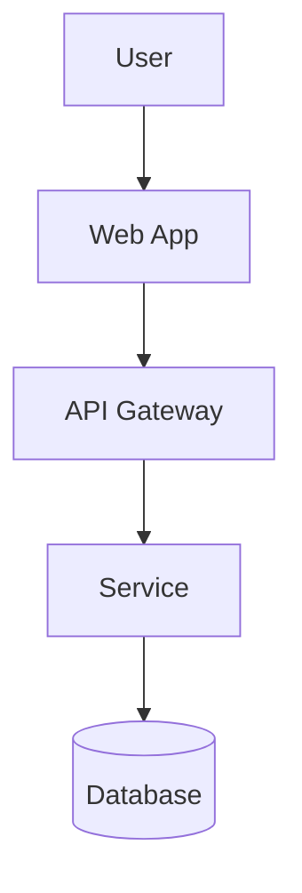

# GenAI DevAssist | Analyst Documentation
## Presentation Outline (75 minutes)

**Version:** 1.0  
**Duration:** 75 minutes  
**Target Audience:** Analysts and product teams  
**Fidelity DevAssist Program**

---

## Presentation Flow Summary

| Time | Section | Duration | Type |
|------|---------|----------|------|
| 0:00 | Opening & Documentation Value | 5 min | Lecture |
| 0:05 | AI-Powered Documentation Basics | 12 min | Lecture + Demo |
| 0:17 | Lab 1: Creating Technical Documentation | 15 min | Hands-on |
| 0:32 | Visual Artifacts with GenAI | 13 min | Lecture + Demo |
| 0:45 | Lab 2: Creating Diagrams | 15 min | Hands-on |
| 1:00 | Documentation Standards & Consistency | 8 min | Lecture |
| 1:08 | Lab 3: Documentation Review | 5 min | Hands-on |
| 1:13 | Wrap-up & Next Steps | 2 min | Discussion |

---

## Slide-by-Slide Breakdown

### Section 1: Opening & Documentation Value (0:00-0:05)

#### Slide 1: Title Slide
**Content:**
- Workshop Title: "Analyst Documentation with GenAI"
- Subtitle: "Clear Communication Through AI-Assisted Documentation"
- Fidelity DevAssist Program logo

---

#### Slide 2: The Documentation Challenge
**Content:**
- Statistics:
  - 70% of project delays tied to unclear requirements
  - Engineers spend 20% of time seeking documentation
  - Poor docs = repeated questions, errors, delays
- "Documentation is communication. Clear docs = successful projects."

**Speaker Notes:**
Ask: "How many hours last week did you spend clarifying requirements?"

---

#### Slide 3: Learning Objectives
**Content:**
1. **Create** clear technical documentation using AI-powered tools
2. **Design** system architecture diagrams, sequence diagrams, and workflow visualizations
3. **Evaluate** documentation consistency and quality standards
4. **Produce** visual artifacts that enhance stakeholder communication

---

#### Slide 4: What GenAI Can Do for Documentation
**Content:**
**Strengths:**
- Transform rough notes into structured docs
- Generate diagrams from descriptions
- Ensure consistent terminology
- Create multiple formats from one source

**Limitations:**
- Can't verify business accuracy
- May miss domain context
- Requires human review for nuance
- Not a replacement for SME knowledge

---

### Section 2: AI-Powered Documentation Basics (0:05-0:17)

#### Slide 5: Documentation Types & Templates
**Content:**
| Type | Purpose | Key Elements |
|------|---------|--------------|
| Requirements | Define what to build | User stories, acceptance criteria |
| Technical Specs | Define how to build | Architecture, data flows, APIs |
| Process Docs | Define how to operate | Workflows, procedures, runbooks |
| User Guides | Enable users | Steps, screenshots, FAQs |

**Speaker Notes:**
Each type has different AI prompting strategies.

---

#### Slide 6: Effective Prompts for Documentation
**Content:**
**Template Structure:**
```
Create a [document-type] for [system/feature]:

Audience: [who will read this]
Purpose: [what they need to accomplish]

Include:
1. [Section 1]
2. [Section 2]
3. [Section 3]

Format: [markdown/confluence/word]
Tone: [technical/business/user-friendly]
Length: [brief/detailed]
```

---

#### Slide 7: Demo - Requirements Documentation
**Content:**
**Demo Scenario:** Portfolio rebalancing feature

**Prompt:**
```
Create a requirements document for a portfolio rebalancing feature:

Audience: Development team and QA
Purpose: Define scope for sprint planning

Include:
1. Feature overview (2-3 sentences)
2. User stories with acceptance criteria (3 stories)
3. Business rules and constraints
4. Out of scope items
5. Dependencies and assumptions

Format: Markdown with clear headers
Tone: Technical but accessible
```

**Demo Script:**
1. Show rough notes/meeting output
2. Execute prompt in Copilot/Claude
3. Review generated document
4. Highlight structure and clarity

---

#### Slide 8: Demo - Technical Specifications
**Content:**
**Prompt:**
```
Create a technical specification for [component]:

Include:
1. Purpose and scope
2. System context (what it interacts with)
3. Data model (entities and relationships)
4. API contracts (endpoints, request/response)
5. Error handling approach
6. Security considerations
7. Performance requirements

Format: Markdown with code blocks for schemas
Include placeholder diagrams [DIAGRAM: description]
```

---

#### Slide 9: Improving Existing Documentation
**Content:**
**Before:** Unclear, incomplete, inconsistent

**AI Enhancement Prompt:**
```
Review and improve this documentation:

[paste existing doc]

Improve:
1. Clarity - simplify complex sentences
2. Completeness - identify gaps, add missing sections
3. Structure - reorganize for better flow
4. Consistency - standardize terminology
5. Actionability - make steps clear

Preserve: All technical accuracy, domain terms
Flag: Any ambiguities needing SME clarification
```

---

### Section 3: Lab 1 - Creating Technical Documentation (0:17-0:32)

#### Slide 10: Lab 1 Introduction
**Content:**
**Objective:** Create professional documentation from rough inputs

**Duration:** 15 minutes

**Scenario:** 
You received these meeting notes about a new feature. Create proper documentation.

**Input:** Rough meeting notes (provided)
**Output:** 
1. Feature requirements document
2. Technical specification outline

---

#### Slide 11: Lab 1 Task Details
**Content:**
**Task 1: Requirements Document (8 min)**
Transform the meeting notes into:
- Feature overview
- 3-5 user stories with acceptance criteria
- Business rules
- Assumptions and dependencies

**Task 2: Technical Spec Outline (7 min)**
Create:
- System context description
- Data model overview
- API contract outline
- Placeholder diagram descriptions

---

### Section 4: Visual Artifacts with GenAI (0:32-0:45)

#### Slide 12: Diagram Types for Analysts
**Content:**
| Diagram Type | Use Case | Tool |
|--------------|----------|------|
| System Architecture | Show component relationships | Mermaid, PlantUML |
| Sequence Diagram | Show interaction flows | Mermaid |
| Flowchart | Show process steps | Mermaid |
| Entity Relationship | Show data model | Mermaid |
| State Diagram | Show status transitions | Mermaid |

---

#### Slide 13: Mermaid Diagram Basics
**Content:**
**Mermaid Syntax Introduction:**


**Why Mermaid:**
- Text-based (version controllable)
- Renders in GitHub, Confluence, many tools
- AI generates it well
- Easy to modify

---

#### Slide 14: Demo - Architecture Diagram
**Content:**
**Prompt:**
```
Create a Mermaid architecture diagram for a portfolio management system:

Components:
- Web Application (Angular)
- Mobile App (React Native)
- API Gateway
- Auth Service
- Portfolio Service
- Transaction Service
- Notification Service
- PostgreSQL Database
- Redis Cache

Show:
- User entry points
- Service dependencies
- Data stores
- External integrations (market data feed)

Use appropriate Mermaid graph syntax with clear labels.
```

**Demo:** Execute prompt, show rendered diagram

---

#### Slide 15: Demo - Sequence Diagram
**Content:**
**Prompt:**
```
Create a Mermaid sequence diagram for user login flow:

Actors: User, Web App, Auth Service, Database

Flow:
1. User submits credentials
2. Web App sends to Auth Service
3. Auth Service validates against Database
4. If valid: generate JWT, return token
5. If invalid: return error
6. Include MFA step after password validation

Show success and failure paths.
```

---

#### Slide 16: Demo - Flowchart
**Content:**
**Prompt:**
```
Create a Mermaid flowchart for trade execution process:

Start: User initiates trade
Steps:
1. Validate order details
2. Check account balance
3. Submit to exchange
4. Receive confirmation
5. Update portfolio
6. Send notification

Include decision points for:
- Insufficient funds
- Market closed
- Order rejected

Use proper flowchart symbols (decisions as diamonds).
```

---

#### Slide 17: Demo - Entity Relationship
**Content:**
**Prompt:**
```
Create a Mermaid ER diagram for portfolio domain:

Entities:
- User (id, email, name)
- Portfolio (id, user_id, name, created_at)
- Holding (id, portfolio_id, symbol, quantity, avg_cost)
- Transaction (id, portfolio_id, type, symbol, quantity, price)

Relationships:
- User has many Portfolios
- Portfolio has many Holdings
- Portfolio has many Transactions

Use proper ER notation with cardinality.
```

---

### Section 5: Lab 2 - Creating Diagrams (0:45-1:00)

#### Slide 18: Lab 2 Introduction
**Content:**
**Objective:** Create visual documentation using AI-generated Mermaid diagrams

**Duration:** 15 minutes

**Tasks:**
1. Architecture diagram for your system
2. Sequence diagram for a key workflow
3. Flowchart for a business process

---

#### Slide 19: Lab 2 Task Details
**Content:**
**Task 1: Architecture Diagram (5 min)**
Create for the portfolio system:
- All major components
- Data flow directions
- External integrations

**Task 2: Sequence Diagram (5 min)**
Create for: "User places a trade"
- All actors and services
- Success and failure paths

**Task 3: Flowchart (5 min)**
Create for: "New account onboarding"
- All steps and decisions
- Approval gates

---

### Section 6: Documentation Standards & Consistency (1:00-1:08)

#### Slide 20: Documentation Quality Checklist
**Content:**
**Before Publishing, Verify:**
- [ ] Clear purpose statement
- [ ] Defined audience
- [ ] Consistent terminology
- [ ] Complete sections (no TBD)
- [ ] Accurate diagrams
- [ ] Reviewed by SME
- [ ] Version and date
- [ ] Owner identified

---

#### Slide 21: Consistency Across Documents
**Content:**
**AI Prompt for Consistency Check:**
```
Review these documents for consistency:

[paste doc 1]
[paste doc 2]

Check:
1. Terminology - same terms for same concepts?
2. Formatting - consistent headers, styles?
3. Detail level - similar depth?
4. Cross-references - accurate links?

List inconsistencies with specific locations.
Suggest standardized terms to use.
```

---

#### Slide 22: Creating Documentation Templates
**Content:**
**Template Creation Prompt:**
```
Create a documentation template for [type]:

Include:
1. Standard sections with placeholder text
2. Instructions for each section (in comments)
3. Example content where helpful
4. Consistent formatting

Format: Markdown
Include: Section for diagrams, version history
```

---

### Section 7: Lab 3 - Documentation Review (1:08-1:13)

#### Slide 23: Lab 3 Introduction
**Content:**
**Objective:** Review documentation for quality and consistency

**Duration:** 5 minutes

**Task:** Use AI to review your Lab 1 and Lab 2 outputs
- Check for completeness
- Verify consistency
- Identify improvement areas

---

### Section 8: Wrap-up & Next Steps (1:13-1:15)

#### Slide 24: Key Takeaways
**Content:**
1. **AI accelerates, doesn't replace** - You verify, AI generates
2. **Structure matters** - Clear prompts = clear docs
3. **Diagrams communicate** - Visual > text for architecture
4. **Consistency builds trust** - Templates and standards
5. **Review is essential** - AI makes mistakes

---

#### Slide 25: Homework & Resources
**Content:**
**Required (Due in 1 week):**
1. Create documentation for one feature using AI
2. Generate 3 diagrams for team documentation
3. Establish one documentation template

**Resources:**
- Mermaid Live Editor: https://mermaid.live
- Documentation Templates: [Internal Link]
- Office Hours: Fridays 11 AM - 12 PM

---

#### Slide 26: Q&A and Feedback
**Content:**
- Questions?
- Feedback survey QR code
- Contact information

---

## Technical Requirements

### Instructor Setup
- Claude/Copilot access
- Mermaid preview extension
- Sample rough notes for demos
- Confluence/SharePoint access

### Participant Requirements
- AI assistant access
- Mermaid viewer (VS Code extension or web)
- Sample documents to improve

---

**End of Presentation Outline**
