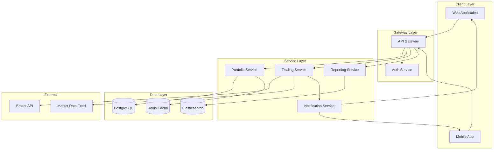
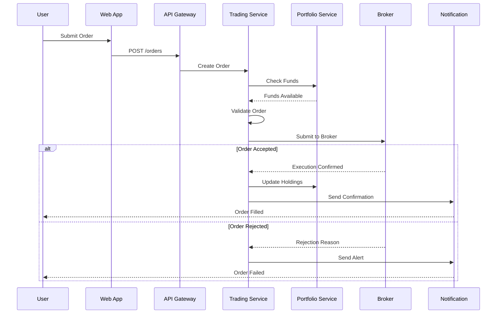
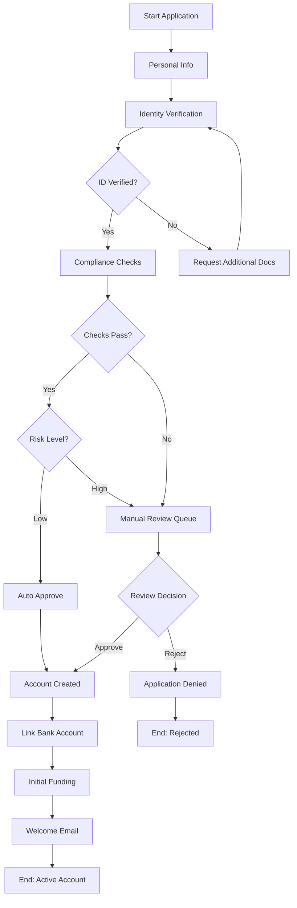
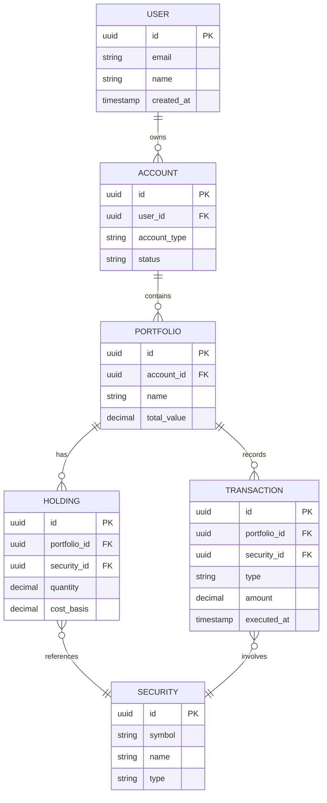
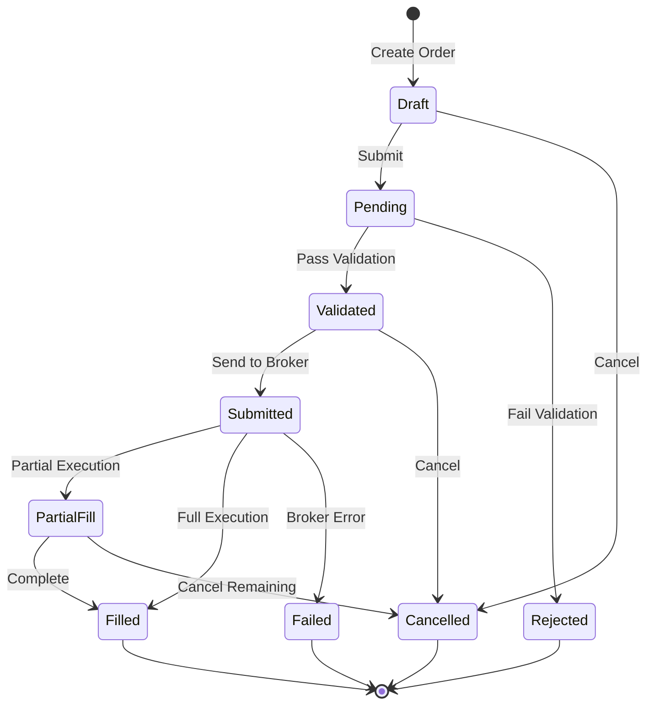
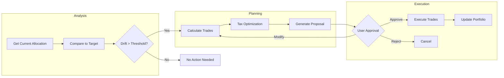

# Sample Diagrams

Collection of example Mermaid diagrams for reference.

---

## 1. Portfolio Management Architecture

---

## 2. Trade Execution Sequence

---

## 3. Account Onboarding Flow

---

## 4. Portfolio Data Model

---

## 5. Order State Machine

---

## 6. Rebalancing Process

---

## Diagram Best Practices

1. **Keep it simple** - Don't overcrowd diagrams
2. **Use consistent naming** - Same terms in docs and diagrams
3. **Add labels** - Explain connections and decisions
4. **Group logically** - Use subgraphs for layers/domains
5. **Test rendering** - Verify at mermaid.live before sharing
