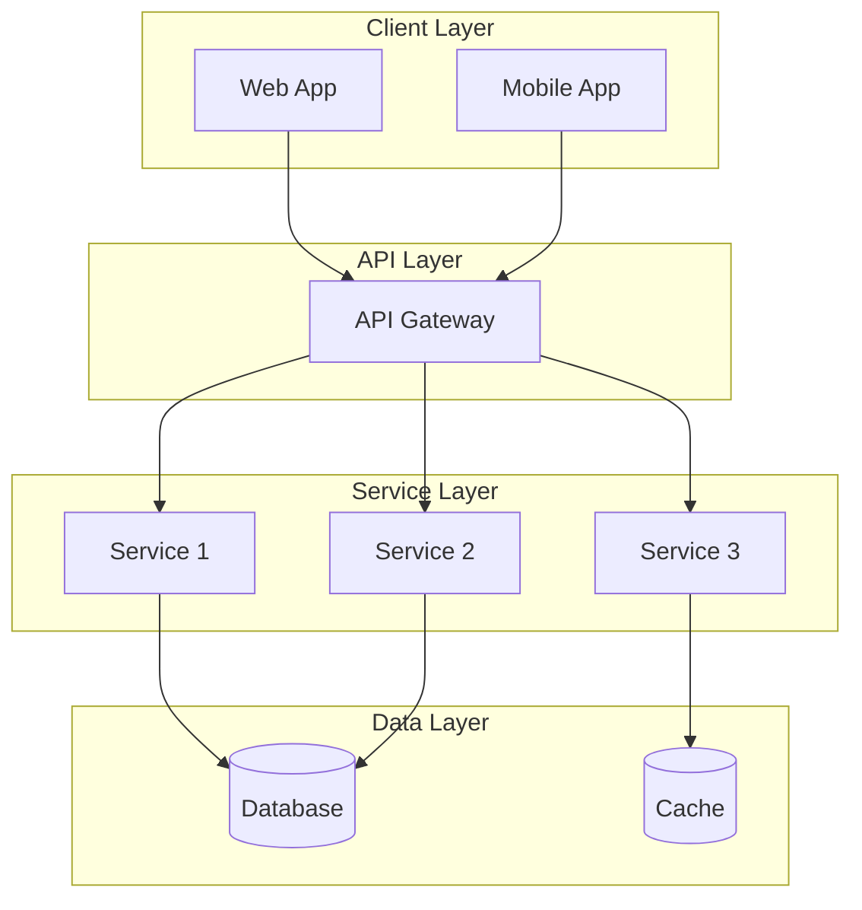
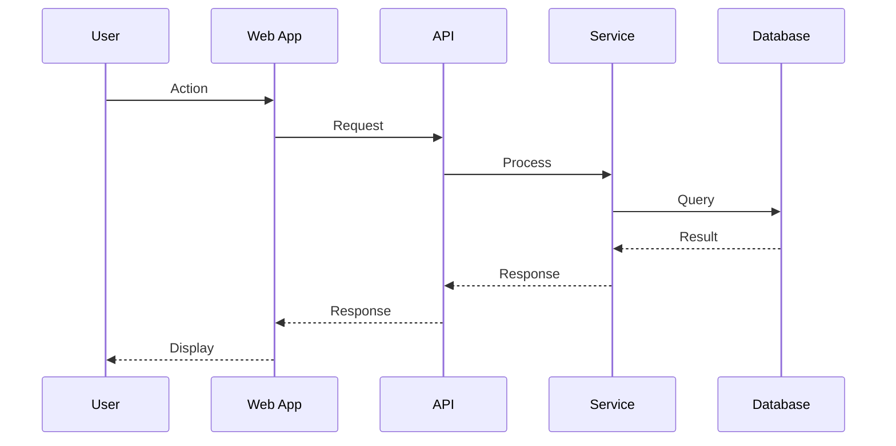
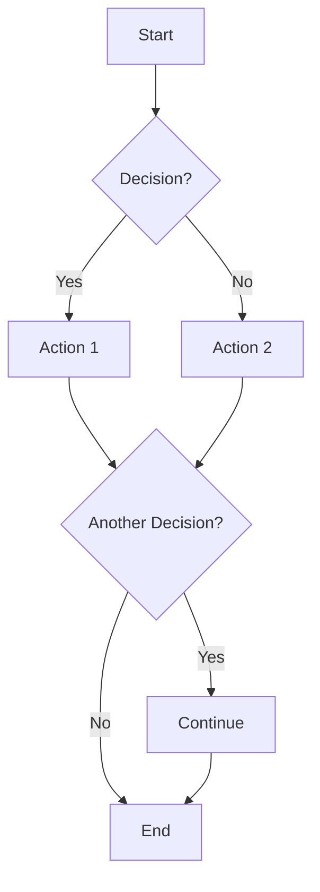
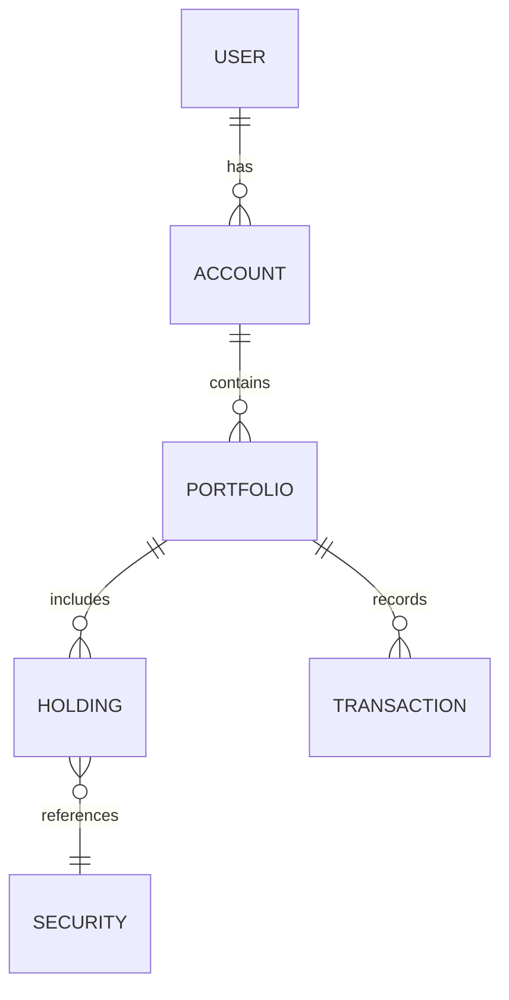
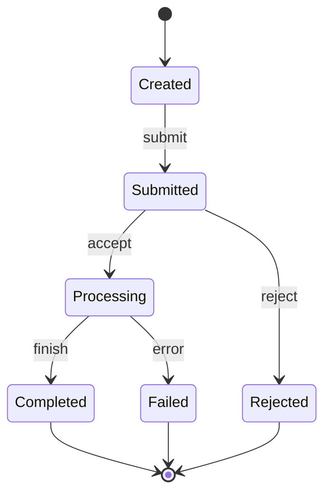
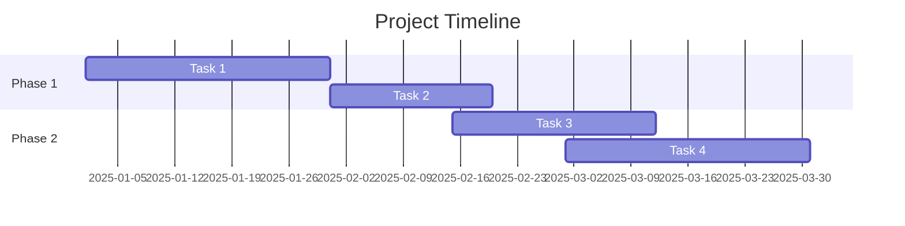

# Mermaid Diagram Templates

## 1. System Architecture

```mermaid
graph TD
    subgraph "Client Layer"
        A[Web App]
        B[Mobile App]
    end

    subgraph "API Layer"
        C[API Gateway]
    end

    subgraph "Service Layer"
        D[Service 1]
        E[Service 2]
        F[Service 3]
    end

    subgraph "Data Layer"
        G[(Database)]
        H[(Cache)]
    end

    A --> C
    B --> C
    C --> D
    C --> E
    C --> F
    D --> G
    E --> G
    F --> H
```

## 2. Sequence Diagram

```mermaid
sequenceDiagram
    participant U as User
    participant W as Web App
    participant A as API
    participant S as Service
    participant D as Database

    U->>W: Action
    W->>A: Request
    A->>S: Process
    S->>D: Query
    D-->>S: Result
    S-->>A: Response
    A-->>W: Response
    W-->>U: Display
```

## 3. Flowchart

```mermaid
flowchart TD
    A[Start] --> B{Decision?}
    B -->|Yes| C[Action 1]
    B -->|No| D[Action 2]
    C --> E{Another Decision?}
    D --> E
    E -->|Yes| F[Continue]
    E -->|No| G[End]
    F --> G
```

## 4. Entity Relationship

```mermaid
erDiagram
    USER ||--o{ ACCOUNT : has
    ACCOUNT ||--o{ PORTFOLIO : contains
    PORTFOLIO ||--o{ HOLDING : includes
    PORTFOLIO ||--o{ TRANSACTION : records
    HOLDING }o--|| SECURITY : references
```

## 5. State Diagram

```mermaid
stateDiagram-v2
    [*] --> Created
    Created --> Submitted: submit
    Submitted --> Processing: accept
    Submitted --> Rejected: reject
    Processing --> Completed: finish
    Processing --> Failed: error
    Completed --> [*]
    Failed --> [*]
    Rejected --> [*]
```

## 6. Gantt Chart

```mermaid
gantt
    title Project Timeline
    dateFormat  YYYY-MM-DD
    section Phase 1
    Task 1           :a1, 2025-01-01, 30d
    Task 2           :after a1, 20d
    section Phase 2
    Task 3           :2025-02-15, 25d
    Task 4           :2025-03-01, 30d
```
