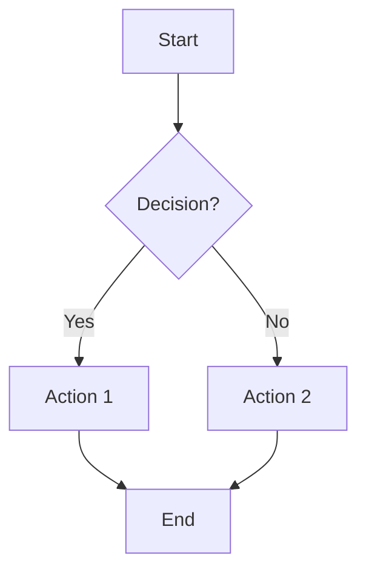

# Process Document: [Process Name]

**Version:** [X.X]
**Author:** [Name]
**Date:** [Date]
**Status:** [Draft/Review/Approved]

---

## 1. Overview

### 1.1 Purpose
[What this process accomplishes]

### 1.2 Scope
[When this process applies]

### 1.3 Owner
[Team/person responsible for this process]

---

## 2. Prerequisites

- [Prerequisite 1]
- [Prerequisite 2]

---

## 3. Process Flow

### 3.1 Flow Diagram

### 3.2 Steps

#### Step 1: [Step Name]
**Owner:** [Role]
**Duration:** [Estimate]

**Actions:**
1. [Action 1]
2. [Action 2]

**Inputs:**
- [Input 1]

**Outputs:**
- [Output 1]

---

#### Step 2: [Step Name]
[Repeat format]

---

## 4. Roles and Responsibilities

| Role | Responsibilities |
|------|------------------|
| | |

---

## 5. Decision Points

| Decision | Criteria | Outcome A | Outcome B |
|----------|----------|-----------|-----------|
| | | | |

---

## 6. Exceptions and Escalations

### 6.1 Exception Handling
[How to handle deviations from standard process]

### 6.2 Escalation Path
| Situation | Escalate To | Timeframe |
|-----------|-------------|-----------|
| | | |

---

## 7. Metrics and SLAs

| Metric | Target | Measurement |
|--------|--------|-------------|
| | | |

---

## 8. Related Documents

- [Document 1]
- [Document 2]

---

## Document History

| Version | Date | Author | Changes |
|---------|------|--------|---------|
| 0.1 | | | Initial draft |
