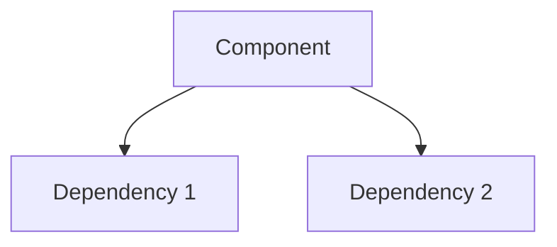
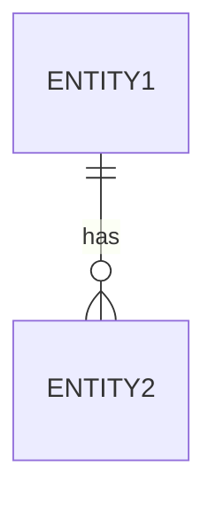

# Technical Specification: [Component/Feature Name]

**Version:** [X.X]
**Author:** [Name]
**Date:** [Date]
**Status:** [Draft/Review/Approved]

---

## 1. Overview

### 1.1 Purpose
[What this component does]

### 1.2 Background
[Context and why this is needed]

### 1.3 Goals
- [Goal 1]
- [Goal 2]

### 1.4 Non-Goals
- [Non-goal 1]

---

## 2. System Context

### 2.1 Architecture Diagram
[DIAGRAM: System context showing this component and its interactions]



### 2.2 Dependencies
| System | Purpose | Interface |
|--------|---------|-----------|
| | | |

---

## 3. Detailed Design

### 3.1 Data Model

#### Entities
[DIAGRAM: ER diagram]



#### Schema
```sql
CREATE TABLE entity (
    id UUID PRIMARY KEY,
    -- fields
);
```

### 3.2 API Design

#### Endpoints

##### GET /resource
**Purpose:** [Description]

**Request:**
```
Headers:
  Authorization: Bearer {token}

Query Parameters:
  - param1 (optional): description
```

**Response:**
```json
{
  "data": [],
  "pagination": {}
}
```

**Error Codes:**
| Code | Meaning |
|------|---------|
| 400 | Invalid request |
| 401 | Unauthorized |
| 404 | Not found |

---

## 4. Security Considerations

### 4.1 Authentication
[How users are authenticated]

### 4.2 Authorization
[Access control approach]

### 4.3 Data Protection
[Encryption, PII handling]

---

## 5. Performance Requirements

| Metric | Target | Measurement |
|--------|--------|-------------|
| Response time | <200ms | P95 |
| Throughput | 1000 req/s | Peak |

---

## 6. Error Handling

### 6.1 Error Response Format
```json
{
  "error": {
    "code": "ERROR_CODE",
    "message": "Human readable message",
    "details": {}
  }
}
```

### 6.2 Error Codes
| Code | HTTP Status | Description | Action |
|------|-------------|-------------|--------|
| | | | |

---

## 7. Testing Strategy

### 7.1 Unit Tests
- [Coverage targets]

### 7.2 Integration Tests
- [Key scenarios]

### 7.3 Performance Tests
- [Load testing approach]

---

## 8. Deployment

### 8.1 Configuration
| Setting | Default | Description |
|---------|---------|-------------|
| | | |

### 8.2 Rollout Plan
1. [Step 1]
2. [Step 2]

---

## 9. Monitoring

### 9.1 Metrics
- [Metric 1]
- [Metric 2]

### 9.2 Alerts
| Alert | Condition | Severity |
|-------|-----------|----------|
| | | |

---

## 10. Open Questions

1. [Question 1]
2. [Question 2]

---

## Document History

| Version | Date | Author | Changes |
|---------|------|--------|---------|
| 0.1 | | | Initial draft |
